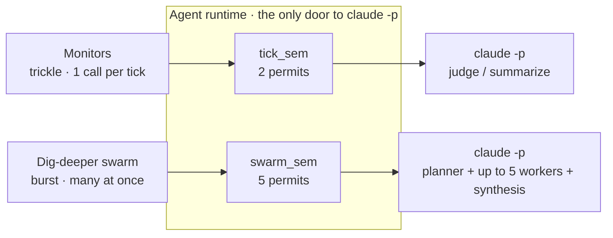
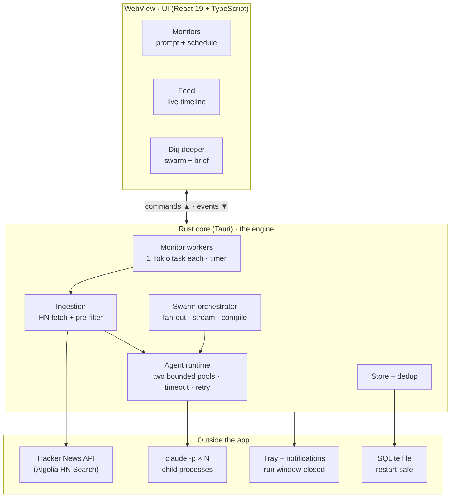
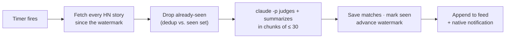
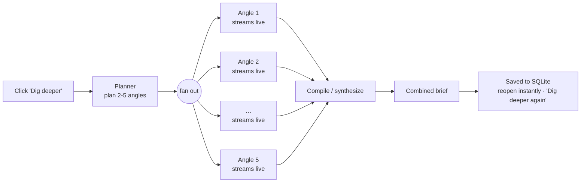
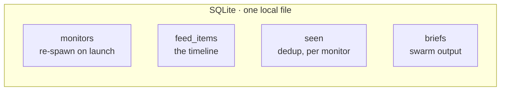

# HN Watch - Architecture

How the app is put together, end to end. All diagrams below render directly on GitHub.

For how to run and use the app, see the [README](./README.md). For the verbatim assignment brief,
see [`docs/REQUIREMENTS.md`](./docs/REQUIREMENTS.md).

## The one idea

Scheduled **monitors** and the on-demand **dig-deeper swarm** are the same primitive - a `claude -p`
call - driven at opposite tempos:

- **Monitors = a trickle.** One call per tick, running forever in the background.
- **Swarm = a burst.** Many calls fired the instant you click "Dig deeper".

Both go through one **agent runtime**, but that runtime keeps **two strictly separate concurrency
pools** so the two tempos never fight each other:

Strict separation, no overflow: an interactive swarm never queues behind background ticks, and a
long-running swarm never blocks a scheduled tick. The scarce resource being protected is the
upstream Claude rate limit, not the laptop. (`src-tauri/src/agent.rs`)

## System map

Three tiers: the WebView UI, the Rust core, and everything outside the app. The UI talks to the core
over Tauri commands (UI to Rust) and events (Rust to UI); every path to Claude funnels through the
one agent runtime.

## Flow · monitor tick (the trickle)

One tick = one pass for one monitor. The order matters: nothing is written until the whole window
has been judged, so a crash or a failed batch is safe to retry.

Key properties:

- **Watermark, not "newest 30".** Each monitor carries a watermark and pulls *everything* since it
  (paginated), so a burst of stories is not silently truncated to 30. The watermark advances to
  `max(created_at) - 5 min` because Algolia indexes asynchronously; the 5-minute margin re-scans the
  tail each tick (free - it is `seen`-deduplicated). First tick looks back 1 hour. A per-tick cap of
  5 pages × 100 = 500 stories bounds the window after a long laptop sleep; the watermark then
  self-heals over the next ticks.
- **Fail-closed.** The unseen set is judged in chunks of ≤ 30, run sequentially within a tick. If any
  batch fails, the tick returns an error **before any DB write** - nothing is committed, the
  watermark does not advance, and the whole window is re-judged next tick. No half-ingested state.
- **A 0-match tick is a valid empty result, not an error.**
- **Sandboxed, pinned calls.** Every `claude` call runs from a temp dir with `$PWD` overridden,
  `--safe-mode`, and null stdin, so a background tick can never read your files or trip a macOS
  file-access prompt. All calls pin `--model claude-sonnet-5` so results do not drift with the host's
  default model.

(`src-tauri/src/tick.rs`, `src-tauri/src/scheduler.rs`)

## Flow · dig deeper (the burst)

Clicking "Dig deeper" on a feed card plans a handful of angles, then fans out one streaming
`claude -p` worker per angle - all at once - and compiles their findings into one brief.

Key properties:

- **Dynamic angles.** The planner proposes between 2 and 5 angles for the specific story (e.g. the
  company and people, how the tech works, the market and rivals, a skeptic's take). Workers run with
  least privilege - `--allowedTools WebSearch WebFetch`.
- **Real streaming, real cancellation.** Workers run `claude -p --output-format stream-json`;
  progress forwards live to per-angle lanes. Closing the panel aborts in-flight work via a `JoinSet`
  + `kill_on_drop`, which SIGKILLs the `claude` children - no orphaned processes, in any phase
  (planning, running, or synthesizing).
- **Graceful degradation.** A failed or timed-out angle does not sink the run: the brief still
  compiles from the survivors and notes the gap.
- **Persisted.** A finished run (brief + every angle) is saved per feed item; reopening shows it
  instantly from SQLite and spawns zero `claude`.

(`src-tauri/src/swarm.rs`, `src-tauri/src/agent.rs`)

## Persistence

Everything the app needs to survive a restart lives in one local SQLite file. On launch, monitors
re-spawn their workers and the feed re-renders from disk.

(`src-tauri/src/db.rs`)

## Where things live

| Concern | File |
| --- | --- |
| Agent runtime + the two pools (`tick_sem` = 2, `swarm_sem` = 5) | `src-tauri/src/agent.rs` |
| Monitor tick pipeline (fetch → judge → persist) | `src-tauri/src/tick.rs` |
| Monitor scheduling (per-monitor Tokio workers) | `src-tauri/src/scheduler.rs` |
| Dig-deeper orchestration (plan → fan-out → compile) | `src-tauri/src/swarm.rs` |
| Hacker News fetching | `src-tauri/src/hn.rs` |
| SQLite store, schema, migrations | `src-tauri/src/db.rs` |
| Tauri commands + events | `src-tauri/src/commands.rs` |
| Tray + notifications | `src-tauri/src/tray.rs` |
| React UI | `src/` (`components/`, `api.ts`, `types.ts`) |
