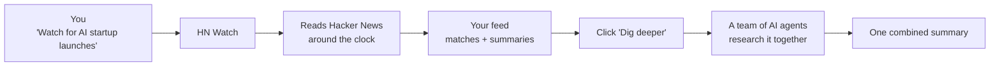
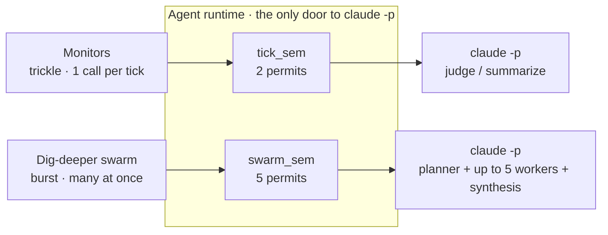
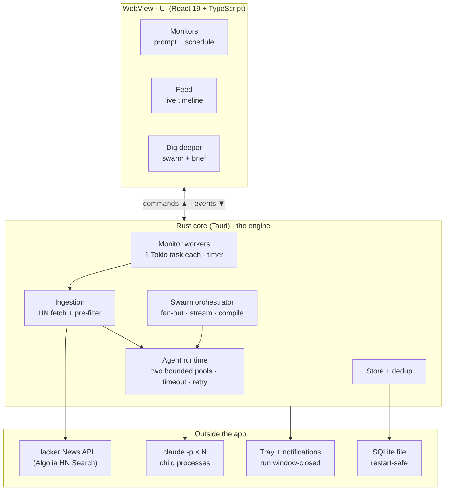
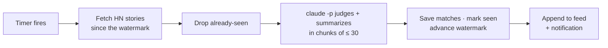
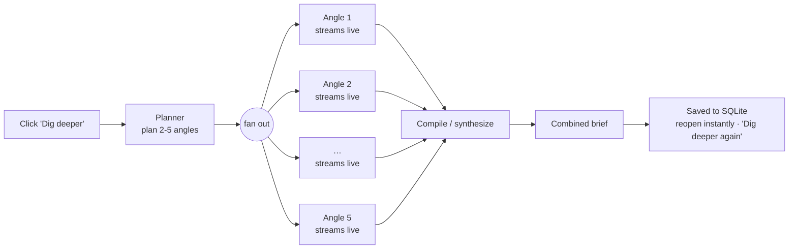
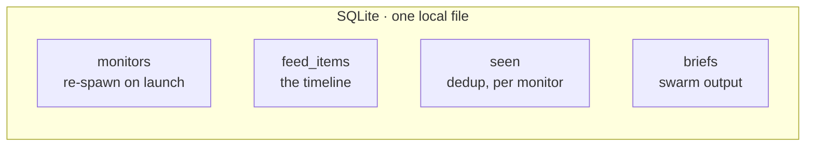

# HN Watch - Architecture

Two ways to read this:

- **[In plain English](#in-plain-english)** + **[How it works](#how-it-works)** - no tech background needed.
- **[Under the hood](#under-the-hood)** - the mechanics and source files, for developers.

Diagrams render on GitHub. To run the app, see the [README](./README.md).

---

## In plain English

**HN Watch is a tireless assistant that reads [Hacker News](https://news.ycombinator.com) for you.**

Tell it what you care about, in your own words. It watches around the clock and drops matching stories -
each with a one-line summary - into your feed. It lives in the menu bar and notifies you when something
new lands.

Want more on a story? Click **Dig deeper**. A small team of AI agents researches it from different
angles at once, then hands you one combined summary.

All powered by Claude on your own computer. No server, no cloud.

## How it works

1. **Set up a watch.** Describe what you care about, and how often to check (15 min to 6 hours).
2. **It checks for you.** Each check, Claude picks the stories that match and summarizes them.
3. **Matches land in your feed.** No duplicates. Everything saved locally.
4. **It watches in the background.** Runs in the menu bar; notifies you on new matches.
5. **Dig deeper any time.** Several agents research one story at once, combined into a single brief.

---

## Under the hood

The technical design: how the pieces fit, and which file owns what.

### One runtime, two rhythms

Monitors and the dig-deeper swarm are the same primitive - a `claude -p` call - at two speeds:

- **Monitors: a trickle.** One call per tick, forever, in the background.
- **Swarm: a burst.** Many calls at once when you click Dig deeper.

One runtime, but **two separate pools**, so they never fight:

Strict separation, no overflow: a swarm never waits on ticks, a tick never waits on a swarm. The limit
being protected is Claude's rate limit, not the laptop. (`agent.rs`)

### System map

Three tiers. The UI talks to the Rust core over Tauri commands (up) and events (down); every path to
Claude goes through the one agent runtime.

### Flow · monitor tick (the trickle)

One tick = one pass for one monitor. Nothing is saved until the whole batch is judged, so a failure is
safe to retry.

- **Watermark, not "newest 30".** Each monitor tracks a watermark and pulls everything since it, so a
  burst isn't truncated. It advances to `max(created_at) - 5 min` (Algolia indexes late); the margin
  re-scans the tail, deduped for free. First tick: last 1 hour. Capped at 500 stories/tick.
- **Fail-closed.** If any batch fails, the tick errors **before any DB write** - nothing saved,
  watermark held, whole window re-judged next tick.
- **Empty is valid.** 0 matches is a result, not an error.
- **Sandboxed + pinned.** Each call runs in a temp dir, `--safe-mode`, null stdin, pinned to
  `--model claude-sonnet-5`.

(`tick.rs`, `scheduler.rs`)

### Flow · dig deeper (the burst)

Plan a few angles, fan out one streaming worker per angle - all at once - then compile into one brief.

- **Dynamic angles.** The planner picks 2-5 angles per story (company, tech, market, risks). Workers get
  only `--allowedTools WebSearch WebFetch`.
- **Live + cancellable.** Workers stream via `--output-format stream-json`. Closing aborts them
  (`JoinSet` + `kill_on_drop` → SIGKILL) - no orphaned processes.
- **Degrades gracefully.** A failed angle doesn't sink the run; the brief compiles from the rest.
- **Persisted.** Saved per story; reopen instantly, spawns zero `claude`.

(`swarm.rs`, `agent.rs`)

### Persistence

One local SQLite file. On launch, monitors re-spawn and the feed re-renders from disk.

(`db.rs`)

### Where things live

| Concern | File |
| --- | --- |
| Agent runtime + the two pools (`tick_sem` = 2, `swarm_sem` = 5) | `src-tauri/src/agent.rs` |
| Monitor tick pipeline (fetch → judge → persist) | `src-tauri/src/tick.rs` |
| Monitor scheduling (per-monitor Tokio workers) | `src-tauri/src/scheduler.rs` |
| Dig-deeper orchestration (plan → fan-out → compile) | `src-tauri/src/swarm.rs` |
| Hacker News fetching | `src-tauri/src/hn.rs` |
| SQLite store, schema, migrations | `src-tauri/src/db.rs` |
| Tauri commands + events | `src-tauri/src/commands.rs` |
| Tray + notifications | `src-tauri/src/tray.rs` |
| React UI | `src/` (`components/`, `api.ts`, `types.ts`) |
